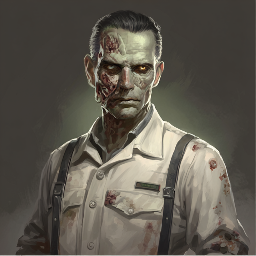

# Hackathon Team Members

- Peter Smith - [Github](https://github.com/users/petedanielsmith/projects/3) - [LinkedIn](https://www.linkedin.com/in/petedanielsmith/)
- Johnny Dussot - [Github](https://github.com/JonathanDussot) - [LinkedIn](https://www.linkedin.com/in/jonathan-dussot/)
- Matt McCarthy - [Github](https://github.com/SADGHOBLIN) - [LinkedIn](https://www.linkedin.com/in/sadghoblin/)
- Sonia Sudiwala - [Github](https://github.com/Sonya-J00) - [LinkedIn](www.linkedin.com/in/sonia-sudiwala)


# Lost Souls - Halloween Hackathon 0ct 2025
Lost Souls is a site that has been created solely with the purpose of offering top-quality experiences to a market that hasn't been addressed as of yet; the Undead. The site allows our unliving users to book an event that appeals to them, whether it's a unique possession or haunting experience, or simply a little R&R away same four walls of the user's usual crypt.


The live link for "Lost Souls" can be found [HERE](https://halloween-hackathon-25.petedanielsmith.co.uk/)

## Table of Contents
+ [UX](#ux "UX")
  + [Site Purpose](#site-purpose "Site Purpose")
  + [Site Goal](#site-goal "Site Goal")
  + [Audience](#audience "Audience")
  + [Communication](#communication "Communication")
  + [Existing User Goals](#existing-user-goals "Existing User Goals")
  + [New User Goals](#new-user-goals "New User Goals")
  + [Future Goals](#future-goals "Future Goals")
+ [User Stories](#user-stories "User Stories")
  + [Admin stories](#admin-stories "Admin stories")
  + [Site User stories](#site-user-stories "Site User stories")
+ [Design](#design "Design")
  + [Colour Scheme](#colour-scheme "Colour Scheme")
  + [Imagery](#imagery "Imagery")
+ [Features](#features "Features")
  + [Existing Features](#existing-features "Existing Features")
+ [Testing](#testing "Testing")
  + [Validator Testing](#validator-testing "Validator Testing")
  + [Responsiveness Testing](#responsiveness-testing "Responsiveness Testing")
  + [Bug Testing](#bug-testing "Bug Testing")
+ [Technologies Used](#technologies-used "Technologies Used")
  + [Main Languages Used](#main-languages-used "Main Languages Used")
  + [Databases](#databases "Databases")
  + [Installed dependencies](#installed-dependancies "Installed dependencies")
+ [Development and Deployment](#development-and-deployment "Development and Deployment")
+ [Credits](#credits "Credits")
  + [Content](#content "Content")
  + [Media](#media "Media")

## UX

### Site Purpose:
The aim of this site is to bring all undead spirits together from around the world.  It is still a rather niche market, where we hope to offer this audience something original that they wouldn't be able to find anywhere else among this mortal realm.  It also offers them the chance to interact to leave reviews based on their experiences with our service.

### Site Goal:
To propagate a variety of experiences and events our soulless companions can take full advantage of.  It aims to bring them various options to explore new haunts and/ or environments.

### Audience:
Naturally it is clearly aimed to the undead since only they can really benefit from our services, yet the living can still catch a quick preview of what's in store once they are eligible to sign up for our site.  We aim to be the first to provide this service and reunite ghouls from all different backgrounds.

### Communication:
users are provided with the possibility to review experiences and interact with one another via their reviews.

### Existing User Goals:
The endless joy of eternal scares in our ever-expanding event catalogue.

### New User Goals:
To feel welcomed by the existing community of undead users we have and explore options in the afterlife they may have never previously considered.

### Future Goals:
- We aim to build an online ouija application where many undead can taunt the living and interfere with their ceremonies, for entertainment purposes of course.
- We seek to contact other mediators around the world to help broaden our catalogue of events to choose from, appealing to different tastes our undead clients may have.

## User Stories

### Admin stories:
#### As an admin:
- As an admin I can see registered user's information on the system, preferred payment method of souls and preferences.
- As an admin I can ensure it only allows the undead to sign up and access our services.

### Site User stories:

#### Home/Events:
- [x] As a user I can enter key words in the search field so that I can filter the events that interest me.
- [x] As a user I can scroll down and switch pages to continue viewing more options.
- [x] As a living user I am restricted access to signing up for the service until I pass away.

#### Purchase feature:
- [x] As a user I can proceed to purchase an event and enter my payment details
- [x] As a user I can confirm my purchase is successful.

#### Review:
- [x] As an undead user, I can enter my review of an event I have bought and experienced.
- [x] As an undead user, I can enter my rating of the event so others may see how terrifying it is.

#### Navigation bar:
- [x] As an undead user I can always view the NavBar so that I can navigate between pages.
- [x] As an undead user I can click on the logo to return to the home page.


## Design

### Colour Scheme:

Our team have decided for this Halloween theme Hackathon to naturally go with colours that resemble our favourite holiday. 

- #0d0c13 - Typically used as background colour for the body of the page.

- #16151f - Typically used as the colour for the NavBar and the Footer of the page.

- #f6a824 - This is the colour we used for our nav-links, buttons while using a slightly lighter shade #d8900f for hover effects and button outlines.

### Imagery:

#### Logo

- We created this logo for our website.


#### Favicon

- This favicon was selected from [iconos8](https://iconos8.es).


#### Satisfied Undead Customers

We've generated the following images to represent satisfied undead users who have used our services.


#### images around the site

We have generated or created different images to help us in different features.

 This image is used to display our prices on the events .
 
 The Following are used as images for our different categories of events
 .
 .
 .

 This image is for our Trick or Treat game.
 .

#### About Page

The following images are the profile pictures for the staff of the site.
 .
 .
 .
 .
 .
 .
 .
 .

## Features

### Existing Features:

#### Home Page:


#### Trick or Treat Game:


#### Event Categories:


## Testing

### Validator Testing

- W3 HTML Validator

I ran the website through the validator and recieved no errors.
.

- W3c CSS Validator

I ran the website through the validator and recieved no errors.


- I also checked each of my JS fies through [JSHint](https://jshint.com/) and found no errors in any of the files

| **TEST** | **ACTION** | **EXPECTATION** | **RESULT** |
| ----------------------------- | ----------------------- | --------------------------- | ---------- |
| Home page | lighthouse | Acceptable scores | ✅ |
| Events Page| lighthouse | Acceptable scores | ✅ |
| About Page | lighthouse | Acceptable scores | ✅ |
| Policy Page | lighthouse | Acceptable scores | ✅ |
| Terms & Conditions page | lighthouse | Acceptable scores | ✅ |
| FAQs | lighthouse | Acceptable scores | ✅ |
| WAVE results | WAVE | Acceptable scores | ✅ |
| Microsoft Edge browser | Launch site | Site opens without issue | ✅ |
| Google Chrome browser | Launch site | Site opens without issue | ✅ |

### Responsiveness testing

| **TEST**                      | **ACTION**              | **EXPECTATION**             | **RESULT** |
| ----------------------------- | ----------------------- | --------------------------- | ---------- |
| Home page - responsiveness    | Size site down to 320px | all elements stay on screen | ✅         |
| Home page - responsiveness    | Size site up to 1920px  | all elements stay on screen | ✅         |
| Events page - responsiveness   | Size site down to 320px | all elements stay on screen | ✅         |
| Events page - responsiveness   | Size site up to 1920px  | all elements stay on screen | ✅         |
| About page - responsiveness  | Size site down to 320px | all elements stay on screen | ✅         |
| About page - responsiveness  | Size site up to 1920px  | all elements stay on screen | ✅         |
| Policy page - responsiveness    | Size site down to 320px | all elements stay on screen | ✅         |
| Policy page - responsiveness    | Size site up to 1920px  | all elements stay on screen | ✅         |
| Terms & Conditions page - responsiveness   | Size site down to 320px  | all elements stay on screen | ✅         |
| Terms & Conditions - responsiveness   | Size site up to 1920px  | all elements stay on screen | ✅         |
| FAQs page - responsiveness | Size site down to 320px | all elements stay on screen | ✅         |
| FAQs page - responsiveness | Size site up to 1920px  | all elements stay on screen | ✅         |

### BUG TESTING:
No bugs detected.

## Technologies Used
### Main Languages Used
- HTML5
- CSS3
- Javascript
- Bootstrap 5.3.3
- Python (Django 5.2.7)

### Databases

- [PostgreSQL](https://dbs.ci-dbs.net/)

### Installed Dependencies:
- asgiref==3.10.0
- dj-database-url==3.0.1
- Django==5.2.7
- pillow==12.0.0
- python-dotenv==1.2.1
- sqlparse==0.5.3


## Development and Deployment

### Deployment

Deployment:
We used github actions to auto build docker file, push to repository and deploy in docker

### Development

#### Forking GitHub Repository

Forking allows you to make a copy of a chosen repository to your own GitHub account. This allows you to test and edit the project without making changes to the original. Forking is done by following these steps.

1. Whilst logged into your GitHub account, navigate to the repository you would like to fork.
2. Click on the **Fork** button at the top right of the page.
3. Choose a name to give the repository. It will be intially named as the same as the original repository.
4. Click the **Create Fork** button.

#### Cloning GitHub Repository

Cloning allows you to download a local version of a chosen repository. Cloning can be done by following these steps.

1. Whilst logged into your GitHub account, navigate to the repository you would like to clone.
2. Click the green **<> Code** button.
3. Click on the **Local** tab.
4. Select **HTTPS** and copy the url.
5. Open your chosen IDE and ensure Git is installed.
5. In your IDE terminal type **git clone (url link that you copied)** and hit enter.

#### How to Use

<details>
<summary>How to use this repo (Click to show)</summary>

**Make sure you have:**
- Python installed, this project used V3.12,

**From the terminal:**

Open the folder in a terminal where you want the project to be saved
#### Run git clone:
```
git clone https://github.com/petedanielsmith/HalloweenHackathon2025.git
```
#### Navigate in to the new folder:
```
cd HalloweenHackathon2025
```
#### Setup a virtual enviroment:
Create a virtual enviroment for the project.

Linux / Mac:
```
python3 -m venv .venv
source .venv/bin/activate
```
Windows CMD:
```
python3 -m venv .venv
.venv\Scripts\activate
```
Windows PowerShell:
```
python3 -m venv .venv
.\.venv\Scripts\Activate.ps1
```
#### Install the dependancies:
This will install all the dependancies needed for the project in to the virtual enviroment if it is setup, rather than globally
```
pip install -r requirements.txt
```
#### Add `.env` file
Add a file in the root of the project called .env and add this to the file for local dev:
```
DEBUG=True
SECRET_KEY=dev-secret-key-change-this
DATABASE_URL=sqlite:///db.sqlite3
ALLOWED_HOSTS=localhost,127.0.0.1,0.0.0.0
```
#### Run the migration to create local db
```
python3 manage.py migrate
```
#### Create a local admin user
Run this and enter user, email and passowrds when asked
```
python manage.py createsuperuser
```
#### To launch the server
Run this and then open the url (probably http://127.0.0.1:8000/)
```
python3 manage.py runserver 
```
